

  <h1 align="center">  OmniAgent </h1>
  

  
  
  
  

作为AIHub的子项目，OmniAgent是一个基于大语言模型的现代化智能对话系统，支持多Agent协作、知识库检索、工具调用、MCP服务器集成、实时对话等功能。

## 📋 目录

- [为什么要学习 AI 项目？](#-为什么要学习-ai-项目？)
- [什么是 OmniAgent？](#-什么是-omniagent？)
- [OmniAgent 核心设计](#-omniagent-核心设计)
- [界面预览](#-界面预览)
- [项目质量](#-项目质量)
- [你能学到什么](#-你能学到什么)
- [适合人群](#-适合人群)

## 为什么要学习 AI 项目？
如今AI发展速度可以说达到了惊人的水平，隔一段时间就会出现一个新概念，**MCP**,**Tool Calling**,**Agent**, **RAG**, **Skill**, **Harness**，各个大厂都认识到了AI绝不是泡沫，而是实打实的生产力，纷纷下场招揽AI人才，这也大大降低了算法岗的门槛，AI让整个计算机行业，整个互联网行业焕然一新，可以说带来了相当的增量，有增量就会有人才缺口，就会适当的降低要求，也更有利于我们搭上AI这趟快车。

但是门槛降低并不是点击就送，不需要顶会顶刊也不是你会写个Hello World就可以跻身算法岗的。

如今AI岗位一个是传统的**算法研发岗**，研发岗仍然需要过硬的算法能力与优化技巧，这里还是顶会顶刊者的天下，不否认有优秀的人没有顶会顶刊也能进入传统算法岗，但是其中的竞争强度是相当大的。

另外一个就是**AI应用岗**，如今企业更多的要求是将算法落到实地，企业要生存，生存就要赚钱，光研发赚不了钱，研发出来的东西卖出去，有市场有用户有过硬的产品才能赚钱，所以AI应用岗是现在各大厂正在加紧扩招的岗位之一，包括**Agent工程师、大模型应用工程师、AI后台工程师**等等等等，腾讯、阿里、字节、美团、京东这些大厂也开始下场抢人。

虽说抢人，但是抢的是优秀的人，所以我们要在机会来临之前准备好，这样才能变成那个被抢的人。

很多人在学习大模型时，都会经历一个阶段：明明已经理解了Transformer、Embedding、甚至能调用各种API，但一到真正做项目，就不知道如何下手。

问题的关键在于：**缺少完整的系统级实践经验**。

在真实企业中，AI能力并不是孤立存在的，而是嵌入在一个完整系统中，例如：

- **如何让模型具备决策能力（Agent）**
- **如何让模型具备知识（RAG）**
- **如何让模型调用工具（Tool Calling）**
- **如何将AI系统做成产品（前后端 + 架构）**

因此，仅仅会用模型是不够的，更重要的是**你是否具备将AI能力整合成一个完整系统的能力**

学习一个完整AI项目，本质上是在补齐以下能力：

- 从模型理解 → 到系统设计
- 从调用API → 到构建产品
- 从单点能力 → 到工程闭环

## 什么是 OmniAgent？

OmniAgent 是一个面向工程实践的AI系统项目，它不仅仅是一个聊天工具，而是一个完整的AI能力整合平台。

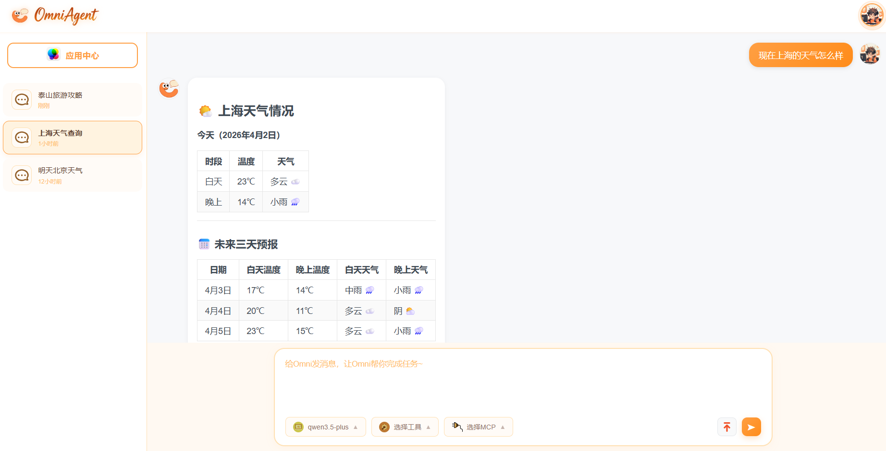

可以把它理解为：

> **一个集成了大模型能力、Agent机制、知识检索、工具调用和前后端系统的完整AI工程模板**

它最大的特点在于：**技术栈非常全面，几乎覆盖当前主流AI工程体系**。

在后端层面，它融合了：

- 基于 **FastAPI** 的高性能服务架构  
- 基于 **LangChain** 的Agent与流程编排  
- 多模型接入（支持主流大模型生态）  
- **RAG检索增强生成系统**  
- **Tool Calling 工具调用机制**  
- **MCP协议（模型上下文扩展能力）**  
- Redis / MySQL 等工程级数据管理  

在前端层面，它提供了：

- 基于 **Vue3 + TypeScript** 的现代化界面  
- 实时流式对话体验  
- Agent配置与管理界面  
- 知识库与工具的可视化操作  

在AI能力层面，它实现了：

- 多Agent协作  
- 自动任务拆解与规划  
- 工具链执行能力  
- 语义检索与知识增强  
- Prompt + Skill 机制  

## OmniAgent 核心设计

OmniAgent的核心价值在于其清晰的系统架构和完整的执行流程，这也是它区别于普通项目的关键。

### 技术架构设计

整个系统采用分层设计思想，将复杂系统拆解为多个独立模块：

- **用户层**：负责交互（Web界面 / 对话系统）
- **对话层**：处理上下文、历史记录、流式输出
- **Agent决策层**：负责任务拆解与执行规划
- **能力层**：
  - RAG（知识检索）
  - Tools（工具调用）
  - MCP（扩展能力）
- **模型层**：大语言模型与Embedding模型
- **数据层**：数据库、缓存、向量数据库

这种架构的优势在于：

- **高可扩展性**：每一层都可以独立替换或增强  
- **强解耦**：功能之间不会强绑定  
- **工程友好**：适合团队开发与演进  

### 核心执行流程

当用户输入一个问题时，系统并不是简单地调用模型，而是会经过一系列智能处理流程：
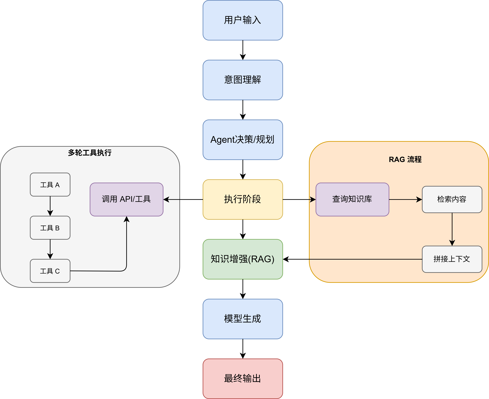

首先，系统会对输入进行理解，判断用户的真实意图，例如是否需要查询知识库、调用工具，或者进行复杂任务。

接下来进入Agent决策阶段，系统会自动拆解任务，例如：

- 查询信息  
- 调用API  
- 组合结果  

如果涉及工具调用，则会进入多轮执行流程：

- 工具A → 工具B → 工具C（逐步依赖执行）

如果涉及知识增强，则会触发RAG流程：

- 检索相关内容  
- 拼接上下文  
- 提供给模型生成更准确结果  

最后，由模型生成最终回答并返回给用户。

整个过程形成一个闭环：

> **输入 → 理解 → 规划 → 执行 → 增强 → 输出**

## 界面预览

### OmniAgent平台登录页
*安全便捷的用户认证系统*
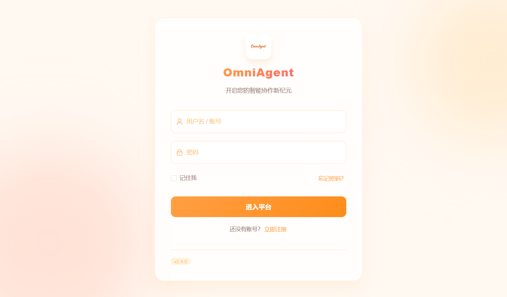

### OmniAgent平台首页
*简洁现代的主界面，提供直观的功能导航*
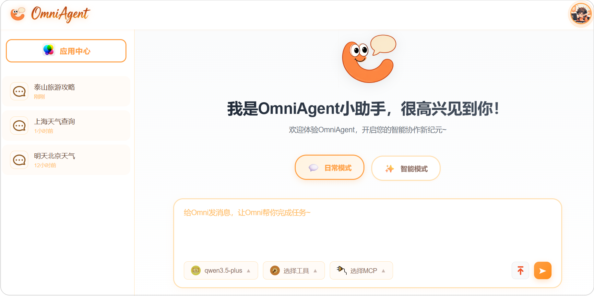

### 智能规划模式
*实时的任务流程图，更加直观的感受*
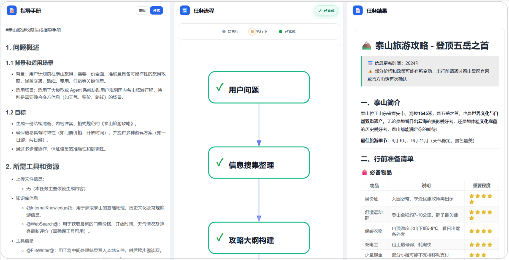

### MCP服务器集成
*支持Model Context Protocol，可上传自定义MCP服务*

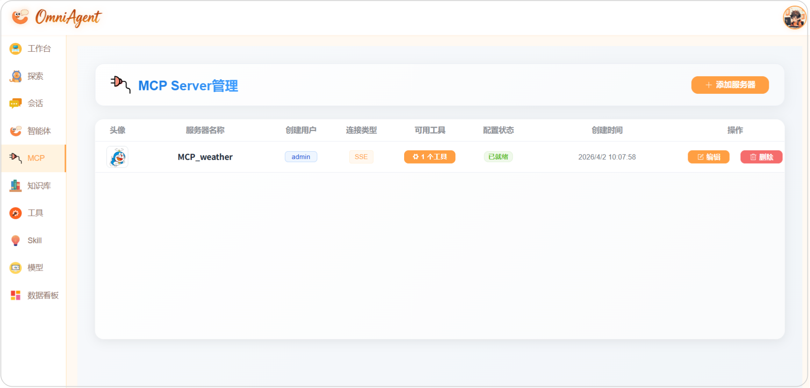

### 知识库管理系统
*智能知识管理，为Agent提供丰富的外部知识支持*

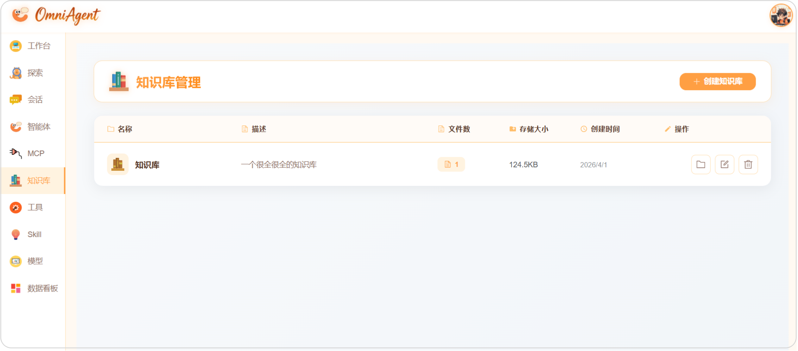

### 文档解析引擎
*支持PDF、Markdown、Docx、Txt等多种格式的智能解析*

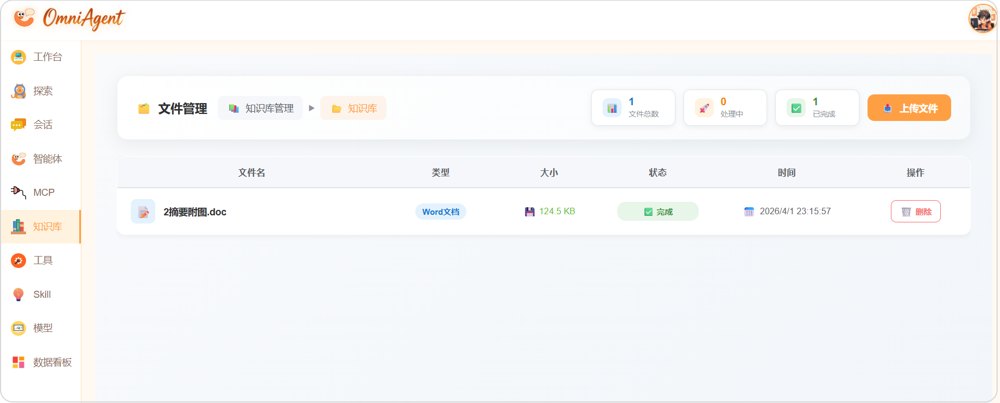

### Skill 管理中心
*能够管理所有已上传的Skill，包括查看、删除、更新等操作*

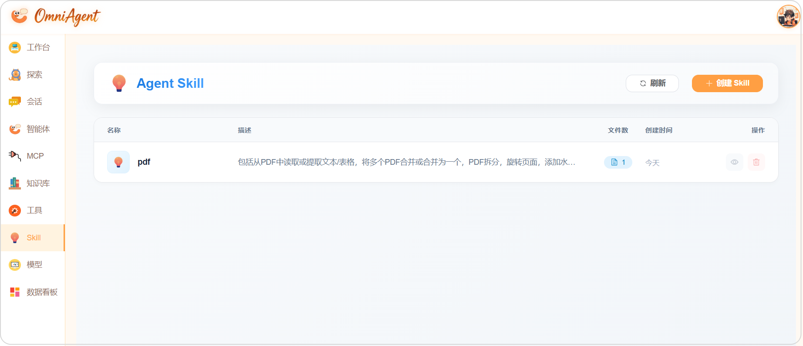

### 智能体管理页面
*强大的Agent配置和管理中心*

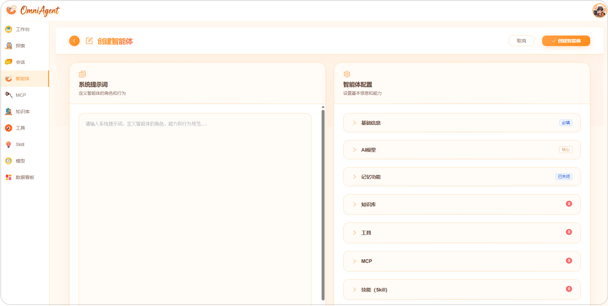

### 智能Agent功能演示

#### 天气查询Agent
*实时天气信息查询和预报*

### 工具管理中心
*丰富的内置工具集，支持用户自定义上传工具*

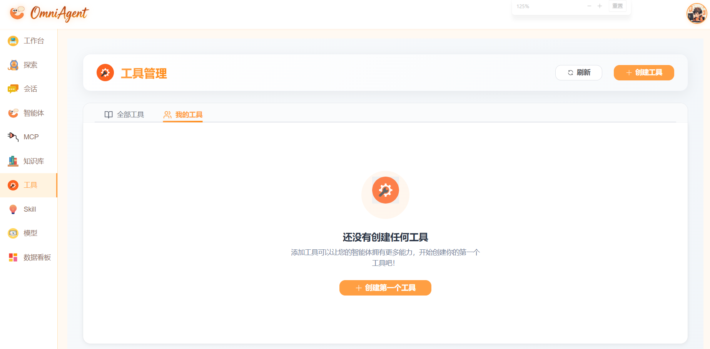

### AI模型管理
*多模型支持，灵活配置不同AI服务*

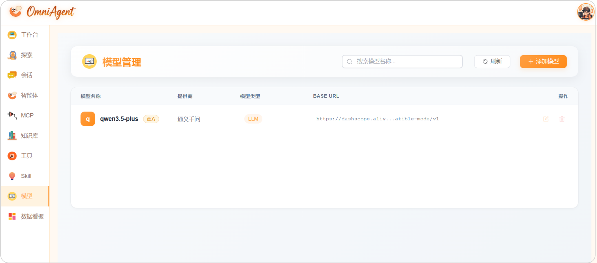

### 数据看板
*能够根据Agent、模型、时间范围进行筛选调用次数和Token使用量* 
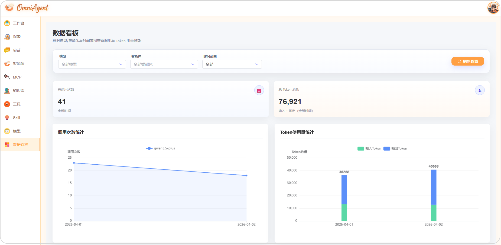    

## 项目质量

相比很多展示型开源项目，OmniAgent更接近真实工程环境。

首先，在工程结构上，它具备清晰的模块划分，例如API层、服务层、工具层、数据层等，符合实际开发规范。

其次，在功能设计上，它不仅仅实现单点能力，而是构建了完整系统，包括多Agent协作机制、工具链执行逻辑、知识库与RAG系统  

此外，在扩展性方面，它支持自定义工具接入、多模型扩展、新Agent能力添加  

同时，项目还具备工程级能力，包括Redis缓存机制、向量数据库支持、异步任务处理  

除了技术栈非常丰富，项目还提供了相当丰富的技术文档和知识点文档，帮助大家更好的理解项目架构和实现细节，来准备面试或者求职。

## 你能学到什么？

完成这个项目后，你获得的不只是一个代码仓库，而是一整套能力体系。

在AI能力层面，你将掌握：

- Agent系统设计方法  
- RAG架构实现  
- Prompt工程进阶技巧  
- Tool Calling机制  
- 多模型协同策略  

在工程能力层面，你将掌握：

- FastAPI后端开发  
- 前后端联调流程  
- 流式输出与实时通信  
- Docker部署与环境管理  

更重要的是，在架构层面，你会理解：

- 如何设计一个AI系统  
- 如何拆解复杂功能  
- 如何构建可扩展架构  

## 适合人群

这个项目更适合有一定基础，希望进阶的人群。

对于学生或求职者来说，如果你希望进入AI或大模型相关岗位，并且需要一个有深度的项目提升竞争力，这个项目非常适合。

对于后端或算法工程师来说，如果你希望从传统开发转向AI工程方向，补齐Agent与RAG能力，这将是一个非常好的实践路径。

对于想做AI产品的人来说，这个项目可以帮助你理解：

- AI产品是如何构建的  
- AI能力如何转化为功能  
- 系统如何支持业务  

需要注意的是，如果是完全零基础的，建议先具备以下能力再学习：

- Python基础  
- 基本的机器学习或大模型认知  